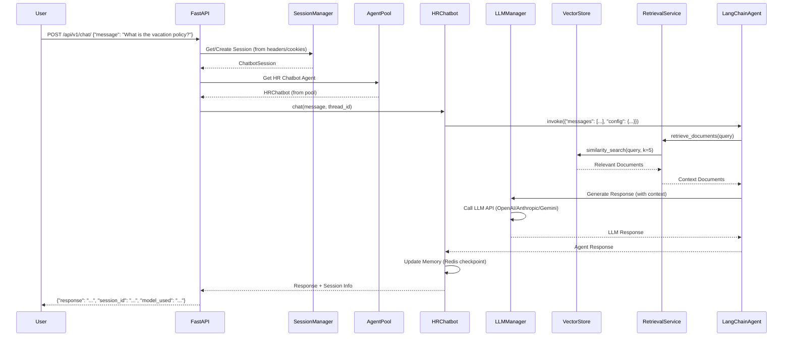

# HR Chatbot Flow

This document describes the complete flow of a user query through the HR chatbot system, from initial request to final response.

## Flow Diagram



## Detailed Flow Steps

### 1. User Request

**Endpoint**: `POST /api/v1/chat/`

**Request Body**:
```json
{
  "message": "What is the vacation policy?"
}
```

**Headers** (optional):
- `X-Session-ID`: Existing session ID
- `X-User-ID`: User identifier

### 2. Session Management

FastAPI uses dependency injection to retrieve or create a session:

```python
session: ChatbotSession = Depends(get_session_from_headers)
```

**Process**:
- Checks for `X-Session-ID` header or `session_id` cookie
- If found, retrieves existing session from `ChatbotSessionManager`
- If not found, creates new session with unique ID
- Returns `ChatbotSession` object

**Session Contains**:
- `session_id`: Unique identifier
- `thread_id`: LangChain thread ID (for checkpointing)
- `user_id`: Optional user identifier
- `created_at`: Session creation timestamp
- `last_activity`: Last activity timestamp
- `message_count`: Number of messages in session

### 3. Agent Retrieval

FastAPI retrieves HR chatbot from the shared agent pool:

```python
chatbot = get_hr_chatbot()  # Returns agent from pool
```

**Agent Pool**:
- Maintains shared agent instances (default: 1 agent)
- Thread-safe for concurrent requests
- Reduces memory usage by ~99% vs per-session agents

See [Session Management](SESSION_MANAGEMENT.md) for details.

### 4. Query Processing

HR chatbot processes the message:

```python
response = chatbot.chat(message, thread_id=session.thread_id)
```

**Process**:
- Loads conversation history from Redis checkpoint (using `thread_id`)
- Prepares message for LangChain agent
- Invokes agent with message and configuration

### 5. Document Retrieval

LangChain agent calls the retrieval tool:

**Tool**: `retrieve_documents(query: str) -> List[Document]`

**Process**:
1. Retrieval service receives query
2. Converts query to embedding using configured embedding model
3. Searches vector store using similarity search
4. Returns top K most relevant documents (default: 5)

**Vector Store**:
- ChromaDB with persistent storage
- Location: `data/vectorstores/chroma_db/hr_chatbot/`
- Collection: `hr_chatbot` (or with embedding suffix)

### 6. Context Retrieval

Vector store returns relevant document chunks:

**Documents Include**:
- `page_content`: Text content of the chunk
- `metadata`: Source information (file name, page number, etc.)

**Example**:
```python
[
    Document(
        page_content="The vacation policy allows employees to accrue...",
        metadata={"source": "hr_policy.pdf", "page": 5}
    ),
    # ... more documents
]
```

### 7. LLM Generation

LangChain agent sends request to LLM with context:

**Request**:
- System prompt: HR-specific instructions
- Agent instructions: Execution flow
- Context: Retrieved documents
- User message: Original query
- Conversation history: Previous messages (from checkpoint)

**LLM Provider**:
- Configured in `hr_chatbot_config.yaml`
- Default: `gemini-2.5-flash`
- Supports: OpenAI, Anthropic, Google (Gemini), Ollama

**Response**:
- Generated answer based on context
- Includes citations to source documents
- Follows HR-specific tone and guidelines

### 8. Memory Update

HR chatbot updates conversation memory:

**Process**:
- Saves new message and response to Redis checkpoint
- Uses `thread_id` as checkpoint key
- Applies memory strategy (trim, summarize, etc.)

**Memory Strategy** (from config):
- `trim`: Keep last N messages
- `summarize`: Summarize old messages
- `trim_and_summarize`: Combine both

### 9. Response

FastAPI formats and returns response:

**Response**:
```json
{
  "response": "The vacation policy allows employees to accrue 1.25 days per month...",
  "session_id": "abc123",
  "model_used": "gemini-2.5-flash",
  "message_count": 5
}
```

**Headers**:
- `X-Session-ID`: Session ID (for client to use in next request)

## Key Components

### ChatbotAgent (Base Class)

- Handles configuration loading
- Creates tools (retrieval, etc.)
- Builds system prompts
- Manages memory
- Coordinates with LangChain agent

### RetrievalService

- Generic document retrieval
- No domain knowledge (works with any chatbot)
- Uses vector store for similarity search
- Returns relevant document chunks

### VectorStoreManager

- Manages vector store lifecycle
- Maps chatbot types to vector stores
- Handles lazy loading and caching
- Thread-safe access

### MemoryManager

- Manages conversation history
- Applies memory strategies
- Integrates with Redis checkpointing
- Handles context window limits

## Error Handling

### Session Errors

- **Session Not Found**: Creates new session
- **Session Expired**: Creates new session, logs warning
- **Max Sessions Reached**: Returns 429 Too Many Requests

### Agent Errors

- **Agent Initialization Failed**: Returns 500 Internal Server Error
- **Agent Pool Exhausted**: Waits or creates new agent (based on config)

### Retrieval Errors

- **Vector Store Not Found**: Returns error, logs warning
- **No Documents Found**: Returns empty context, LLM handles gracefully

### LLM Errors

- **API Key Invalid**: Returns 401 Unauthorized
- **Rate Limit Exceeded**: Returns 429 Too Many Requests
- **Model Error**: Returns 500 with error message

## Performance Considerations

### Caching

- **Agent Pool**: Agents cached and reused
- **Vector Store**: Loaded once, cached in memory
- **Configuration**: YAML configs cached after first load

### Optimization

- **Lazy Loading**: Vector stores loaded on demand
- **Batch Processing**: Multiple documents processed in batches
- **Connection Pooling**: LLM and Redis connections pooled

### Monitoring

- Log all requests and responses
- Track session statistics
- Monitor agent pool usage
- Measure retrieval performance

## Related Documentation

- [Architecture Guide](ARCHITECTURE.md) - System architecture
- [Session Management](SESSION_MANAGEMENT.md) - Session details
- [Configuration Guide](CONFIGURATION.md) - Configuration options
- [API Usage Guide](API_USAGE.md) - API integration

